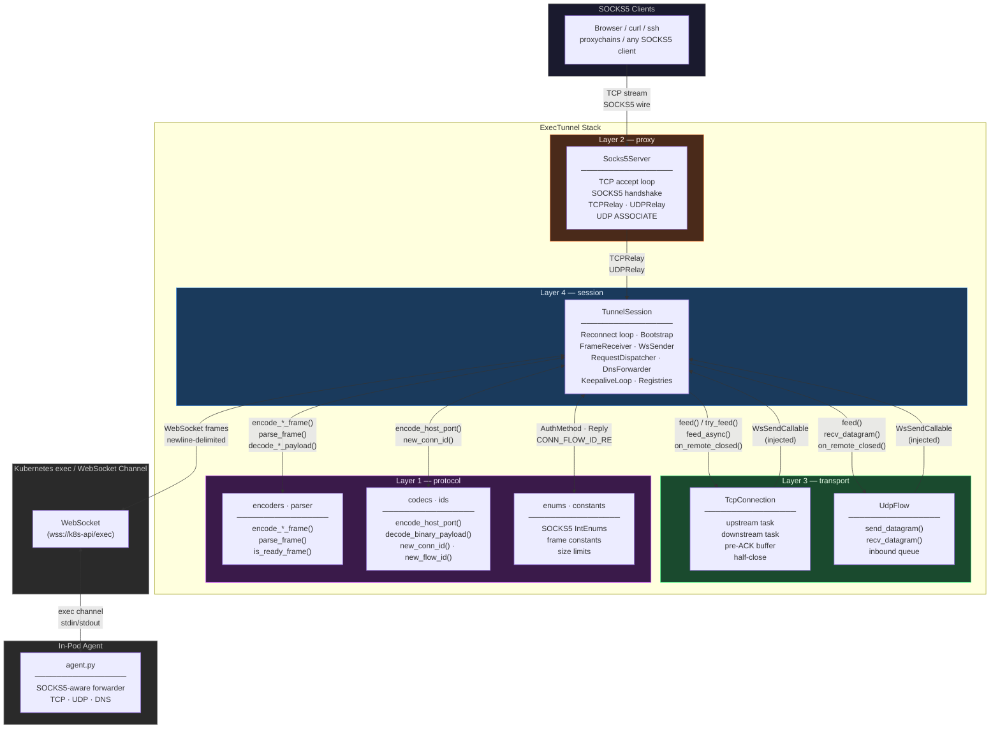
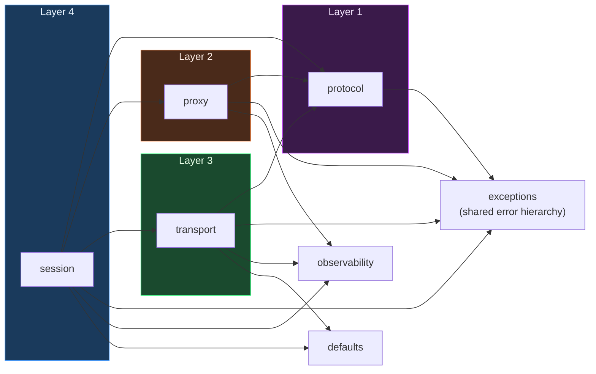
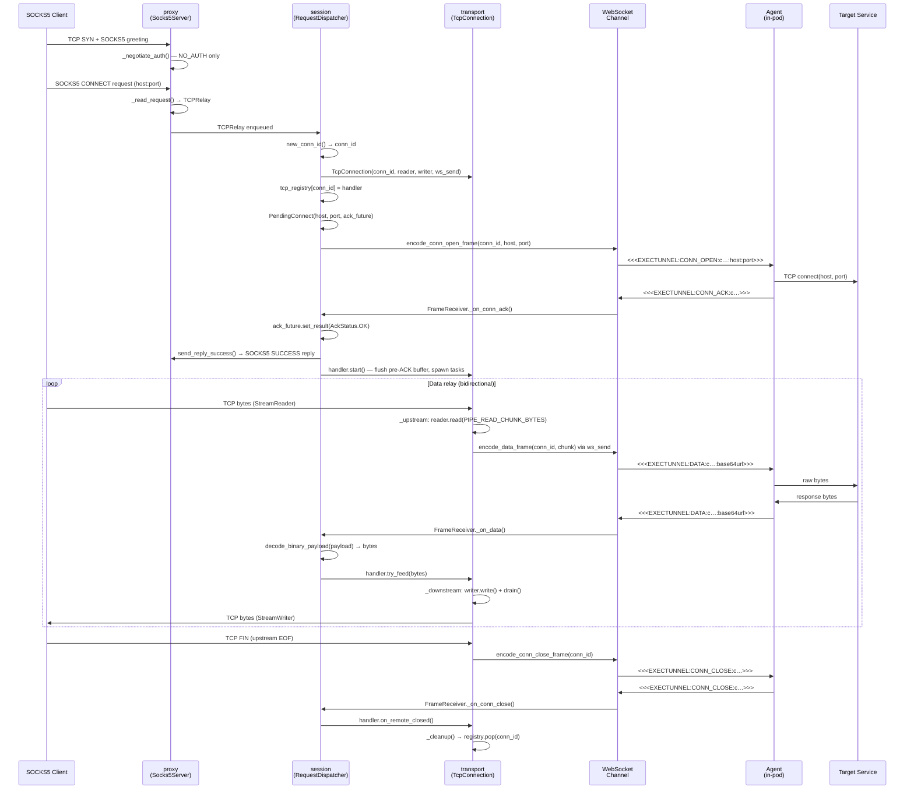
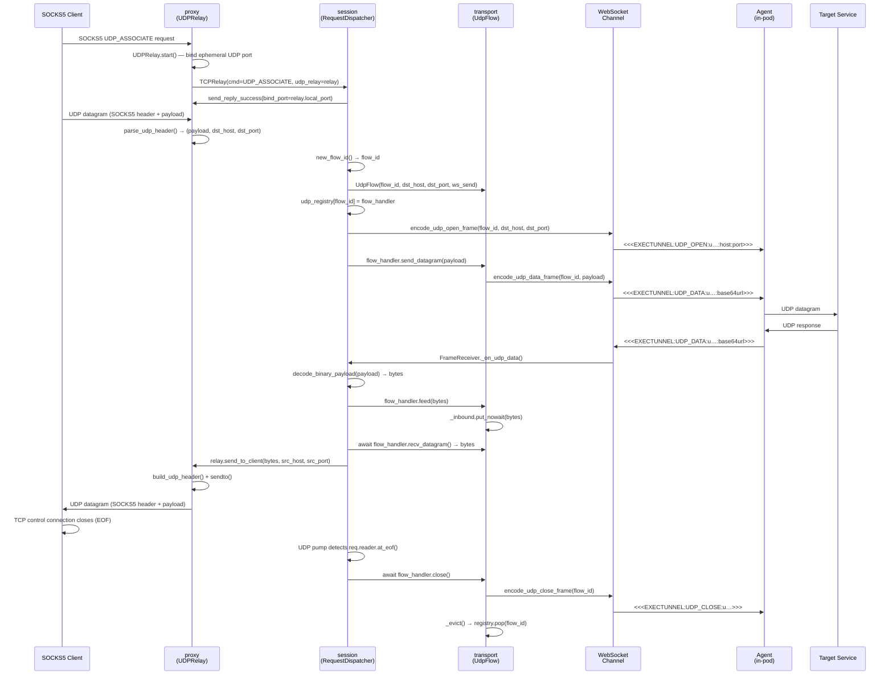
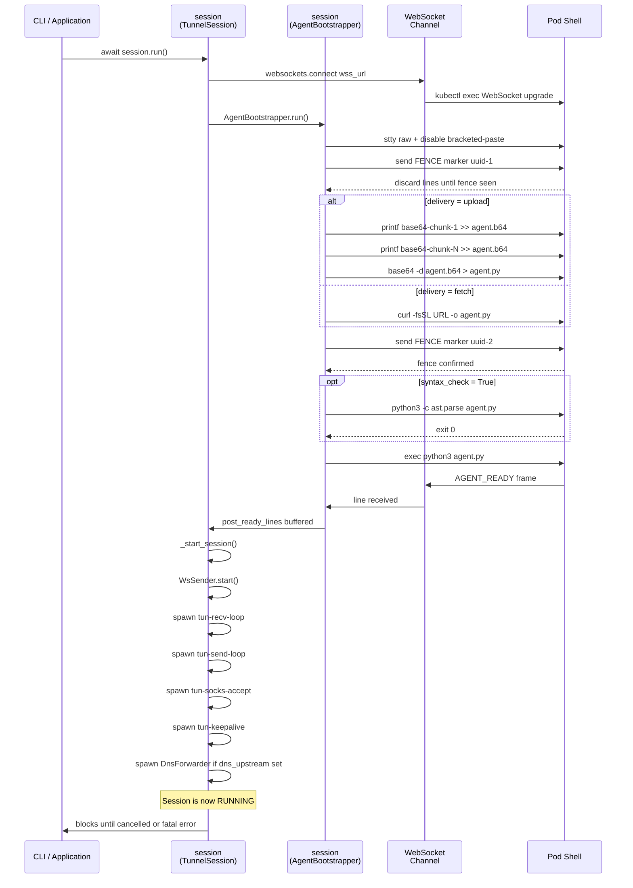
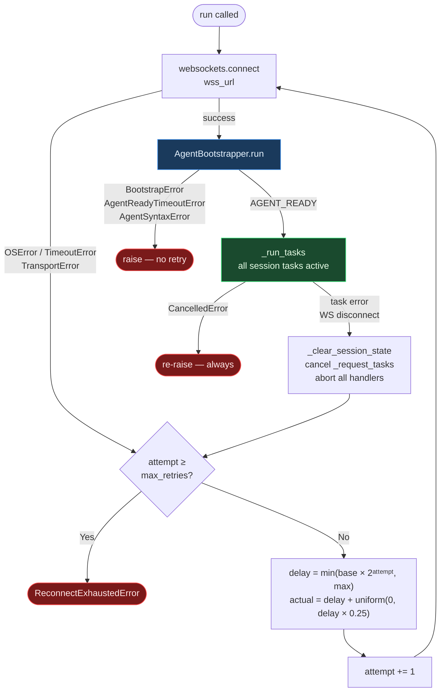
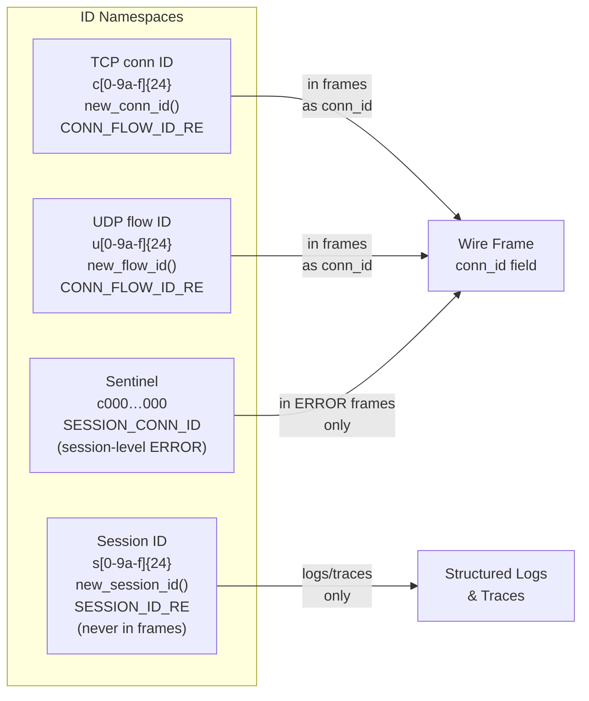
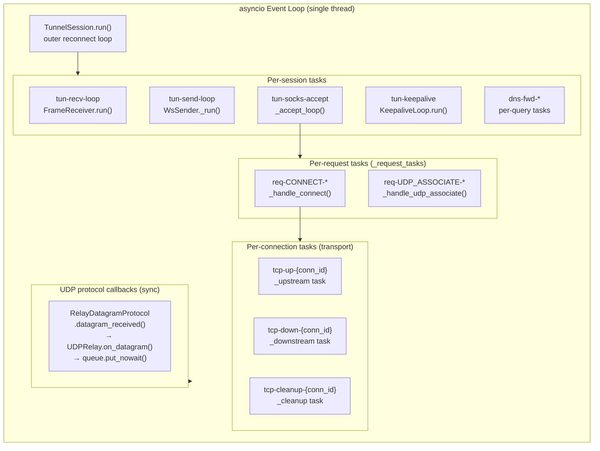
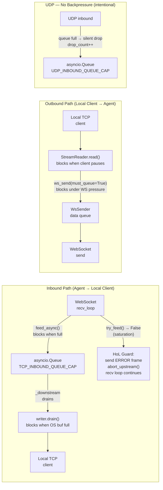
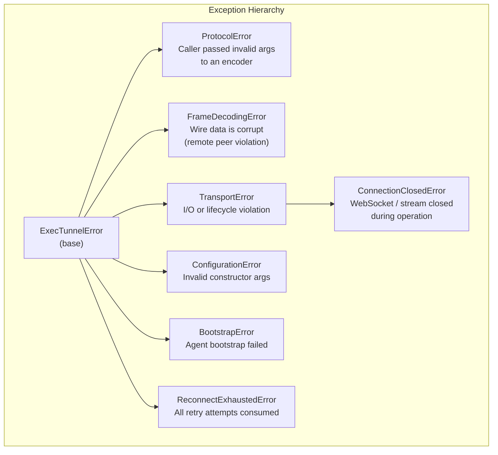

# ExecTunnel — Architecture Overview

> **`docs/ARCHITECTURE/README.md`** · Stack v2.x · Python 3.13+

ExecTunnel is a SOCKS5 proxy tunnel that runs entirely over Kubernetes
`exec`/WebSocket channels — no port-forward, no privileged network access,
no CNI changes required. A local SOCKS5 listener accepts connections from
any standard client (browser, `curl`, `ssh`, `proxychains`), multiplexes
them over a single WebSocket exec channel into a pod, and a lightweight
in-pod agent forwards traffic to its final destination.

This document is the **canonical entry point** for the four-layer
architecture. Each layer has its own detailed specification; this file
explains how they fit together as a whole.

---

## Table of Contents

1. [Architectural Principles](#1-architectural-principles)
2. [Four-Layer Stack Overview](#2-four-layer-stack-overview)
3. [Layer Dependency Rules](#3-layer-dependency-rules)
4. [Layer-by-Layer Reference](#4-layer-by-layer-reference)
    - 4.1 [protocol — Wire Codec](#41-protocol--wire-codec)
    - 4.2 [proxy — SOCKS5 Boundary](#42-proxy--socks5-boundary)
    -
   4.3 [transport — Frame I/O & Connection Lifecycle](#43-transport--frame-io--connection-lifecycle)
    - 4.4 [session — Top Orchestrator](#44-session--top-orchestrator)
5. [End-to-End Data Flows](#5-end-to-end-data-flows)
    - 5.1 [TCP CONNECT — Full Round Trip](#51-tcp-connect--full-round-trip)
    - 5.2 [UDP ASSOCIATE — Full Round Trip](#52-udp-associate--full-round-trip)
    - 5.3 [Bootstrap Sequence](#53-bootstrap-sequence)
    - 5.4 [Reconnection Loop](#54-reconnection-loop)
6. [Frame Wire Format](#6-frame-wire-format)
7. [ID & Namespace System](#7-id--namespace-system)
8. [Concurrency Model](#8-concurrency-model)
9. [Backpressure Architecture](#9-backpressure-architecture)
10. [Error Taxonomy](#10-error-taxonomy)
11. [Observability Surface](#11-observability-surface)
12. [Security Model](#12-security-model)
13. [Extension Guide](#13-extension-guide)
14. [Document Index](#14-document-index)

---

## 1. Architectural Principles

| Principle                    | How It Is Enforced                                                                                                                                                                                            |
|:-----------------------------|:--------------------------------------------------------------------------------------------------------------------------------------------------------------------------------------------------------------|
| **Strict layer isolation**   | Each layer may only import from layers below it and from `exceptions`. Cross-layer imports are architecture violations.                                                                                       |
| **Zero upward imports**      | `protocol` has no I/O. `proxy` has no frame encoding. `transport` has no SOCKS5 knowledge. Violations are caught in CI.                                                                                       |
| **Pure lower layers**        | `protocol` is entirely synchronous and side-effect-free. Every function is a pure transformation testable without an event loop.                                                                              |
| **Dependency injection**     | The `WsSendCallable` is injected downward from `session` into `transport` — `transport` never imports `session`.                                                                                              |
| **Self-evicting registries** | `TcpConnection` and `UdpFlow` remove themselves from the shared registry on cleanup. The session layer never manually removes entries.                                                                        |
| **Single decode site**       | All base64url payload decoding (`decode_binary_payload`, `decode_error_payload`) happens exclusively in the `session` layer. `transport` receives raw `bytes` only.                                           |
| **Typed error hierarchy**    | `ProtocolError` = caller bug (encoder side). `FrameDecodingError` = wire corruption (decoder side). `TransportError` = I/O or lifecycle violation. `ConfigurationError` = invalid constructor arguments.      |
| **Idempotent teardown**      | All `close()` / `on_remote_closed()` / `cleanup()` paths are guarded and safe to call multiple times.                                                                                                         |
| **No silent corruption**     | `decode_binary_payload` pre-validates the base64url alphabet before calling stdlib (which silently discards non-alphabet bytes). `_encode_frame` rejects payloads containing frame delimiters, `\n`, or `\r`. |

---

## 2. Four-Layer Stack Overview



---

## 3. Layer Dependency Rules

The dependency graph is a **strict DAG**. No cycles are permitted at any level — within
a layer or across layers.



### Permitted Import Matrix

| Importer ↓ \ Importee → | `exceptions` | `protocol` | `proxy` | `transport` | `session` | `observability` | `defaults` | `stdlib` |
|:------------------------|:------------:|:----------:|:-------:|:-----------:|:---------:|:---------------:|:----------:|:--------:|
| `protocol`              |      ✅       |     —      |    ❌    |      ❌      |     ❌     |        ❌        |     ❌      |    ✅     |
| `proxy`                 |      ✅       |     ✅      |    —    |      ❌      |     ❌     |        ✅        |     ❌      |    ✅     |
| `transport`             |      ✅       |     ✅      |    ❌    |      —      |     ❌     |        ✅        |     ✅      |    ✅     |
| `session`               |      ✅       |     ✅      |    ✅    |      ✅      |     —     |        ✅        |     ✅      |    ✅     |

> **Rule:** Any import that crosses a forbidden boundary is an architecture violation
> and must be rejected in code review and CI.

---

## 4. Layer-by-Layer Reference

### 4.1 `protocol` — Wire Codec

> **Spec:** [`protocol.md`](./protocol.md)

The lowest layer. **Zero I/O, zero asyncio, zero side effects.** Every function is a
pure transformation.

#### Responsibilities

* Wire encoding and decoding of all 11 frame types
* SOCKS5 RFC 1928 / RFC 1929 integer constants as typed `IntEnum`
* Cryptographic ID generation (`new_conn_id`, `new_flow_id`, `new_session_id`)
* Host/port codec with IPv6 normalisation and frame-injection guards
* Base64url payload codec with explicit alphabet pre-validation

#### Module Map

```
exectunnel/protocol/
├── __init__.py     Public re-export surface — no logic
├── constants.py    Frame delimiters, size limits, classification frozensets
├── enums.py        SOCKS5 IntEnum definitions + _StrictIntEnum base
├── ids.py          ID generation + regex validators
├── types.py        ParsedFrame frozen dataclass
├── codecs.py       Host/port codec + base64url codec
├── encoders.py     All encode_*_frame() public functions
└── parser.py       parse_frame(), is_ready_frame()
```

#### Key Invariants

* `parse_frame(encode_*(args))` is **never** `None` — every encoded frame round-trips
* `parse_frame` returns `None` **iff** the line has no frame prefix/suffix — `None` is
  exclusively "not a tunnel frame", never "corrupt tunnel frame"
* `FrameDecodingError` is raised **iff** the line IS a tunnel frame but is structurally
  corrupt
* All encoded frames are newline-terminated — transport may split on `\n` without any
  other framing
* `SESSION_CONN_ID` (`c` + `0`×24) passes `CONN_FLOW_ID_RE` but can never be produced by
  `new_conn_id()`

---

### 4.2 `proxy` — SOCKS5 Boundary

> **Spec:** [`proxy.md`](./proxy.md)

The SOCKS5 protocol boundary. Translates RFC 1928 wire bytes from local clients into
clean Python objects (`TCPRelay`, `UDPRelay`) consumed by the session layer. **No frame
encoding, no WebSocket, no Kubernetes knowledge.**

#### Responsibilities

* TCP accept loop and SOCKS5 handshake state machine
* `CONNECT`, `UDP_ASSOCIATE` command handling (`BIND` → `CMD_NOT_SUPPORTED`)
* `NO_AUTH` method negotiation only
* IPv4, IPv6, and domain name address types
* UDP datagram relay with client address binding and queue management
* Reply-exactly-once invariant enforcement on `TCPRelay`

#### Module Map

```
exectunnel/proxy/
├── __init__.py        Public re-export surface
├── _constants.py      Shared numeric constants
├── _wire.py           Pure sync wire helpers (no I/O)
├── _io.py             Async stream I/O helpers
├── _handshake.py      SOCKS5 negotiation state machine
├── _errors.py         Handshake exception dispatch
├── _udp_protocol.py   asyncio DatagramProtocol adapter
├── config.py          Socks5ServerConfig frozen dataclass
├── tcp_relay.py       TCPRelay — one completed handshake
├── udp_relay.py       UDPRelay — UDP datagram relay
└── server.py          Socks5Server — accept loop + orchestration
```

#### Key Invariants

* `send_reply_success()` or `send_reply_error()` must be called **exactly once** per
  `TCPRelay`
* For `UDP_ASSOCIATE`, `bind_port=relay.local_port` must be passed to
  `send_reply_success()`
* `UDPRelay.recv()` must not be called before `UDPRelay.start()`
* Domain names in SOCKS5 requests are validated against `_DOMAIN_UNSAFE_RE` — `:`, `\r`,
  `\n`, `<`, `>`, `\x00` are rejected to prevent frame injection

---

### 4.3 `transport` — Frame I/O & Connection Lifecycle

> **Spec:** [`transport.md`](./transport.md)

The frame I/O and connection lifecycle layer. Bridges local OS sockets (from `proxy`) to
the WebSocket send callable (injected from `session`). **No SOCKS5 knowledge, no frame
parsing, no base64 decoding.**

#### Responsibilities

* `TcpConnection`: two asyncio copy tasks (upstream/downstream), pre-ACK buffer,
  half-close semantics, self-eviction
* `UdpFlow`: inbound queue, `send_datagram`/`recv_datagram`, open/close lifecycle,
  self-eviction
* Backpressure via `feed_async()` (blocking) and `try_feed()` (non-blocking saturation
  detection)
* `MAX_DATA_CHUNK_BYTES = 6108` — authoritative per-chunk byte budget derived from
  `MAX_FRAME_LEN`

#### Module Map

```
exectunnel/transport/
├── __init__.py       Public re-export surface
├── _constants.py     Numeric tunables derived from protocol layer
├── _errors.py        Structured task-exception logging
├── _types.py         WsSendCallable, TransportHandler, registry aliases
├── _validation.py    require_bytes() — shared payload type guard
├── _waiting.py       wait_first() — async race helper
├── tcp.py            TcpConnection implementation
└── udp.py            UdpFlow implementation
```

#### Key Invariants

* `start()` called at most once per `TcpConnection`
* `try_feed()` must only be called after `start()` — pre-ACK path must use `feed()`
* UDP datagrams must never be split — one datagram = one `send_datagram()` call
* `MAX_DATA_CHUNK_BYTES` must be imported, never hardcoded as `6108`
* Handlers self-evict — the session layer must never manually remove registry entries

---

### 4.4 `session` — Top Orchestrator

> **Spec:** [`session.md`](./session.md)

The top orchestration layer. Owns the full tunnel lifecycle from WebSocket connection
through agent bootstrap, frame dispatch, TCP/UDP handler wiring, DNS forwarding, and
reconnection. **The only layer that calls `parse_frame()` and `decode_binary_payload()`.
**

#### Responsibilities

* Outer reconnection loop with exponential back-off and jitter
* Agent bootstrap: terminal setup, payload delivery (upload/fetch), `AGENT_READY`
  handshake
* Inbound frame dispatch (`FrameReceiver`) — all 11 frame types
* Outbound frame encoding and priority queuing (`WsSender`)
* TCP/UDP handler construction and registry management
* DNS-over-tunnel forwarding (`DnsForwarder`)
* Host exclusion routing (`is_host_excluded`)
* Per-host concurrency gating and connection pacing
* KEEPALIVE heartbeat loop

#### Module Map

```
exectunnel/session/
├── __init__.py        Public re-export surface
├── session.py         TunnelSession — top-level orchestrator
├── _bootstrap.py      AgentBootstrapper
├── _sender.py         WsSender + KeepaliveLoop
├── _receiver.py       FrameReceiver
├── _dispatcher.py     RequestDispatcher
├── _dns.py            DnsForwarder
├── _routing.py        is_host_excluded() + DEFAULT_EXCLUDE_CIDRS
├── _payload.py        Agent payload loading
├── _state.py          AckStatus + PendingConnect
├── _lru.py            LruDict — bounded LRU cache
├── _udp_socket.py     make_udp_socket / resolve_address_family
├── _constants.py      Shared constants
└── _types.py          AgentStatsCallable, ReconnectCallable
```

#### Key Invariants

* `run()` is the only entry point — there is no `shutdown()` method; cancel the task
* `parse_frame()` and `decode_binary_payload()` are called **only** in this layer
* `handler.start()` must not be called before `ack_future` resolves with `AckStatus.OK`
* On session reset, use `flow.on_remote_closed()` (sync) not `await flow.close()` —
  avoids sending `UDP_CLOSE` over a dead WebSocket
* `asyncio.CancelledError` must never be suppressed

---

## 5. End-to-End Data Flows

### 5.1 TCP CONNECT — Full Round Trip



---

### 5.2 UDP ASSOCIATE — Full Round Trip



---

### 5.3 Bootstrap Sequence



---

### 5.4 Reconnection Loop



**Back-off formula:**

\[\text{delay} = \min\!\left(\text{base\_delay} \times 2^{\text{attempt}},\
\text{max\_delay}\right)\]

\[\text{actual\_delay} = \text{delay} + \mathcal{U}\!\left(0,\ \text{delay} \times
0.25\right)\]

---

## 6. Frame Wire Format

All inter-layer communication over the exec channel uses newline-terminated ASCII
frames.

### Grammar

```
frame        ::= FRAME_PREFIX msg_type [ ":" conn_id [ ":" payload ] ] FRAME_SUFFIX LF
FRAME_PREFIX ::= "<<<EXECTUNNEL:"
FRAME_SUFFIX ::= ">>>"
LF           ::= "\n"
msg_type     ::= "AGENT_READY" | "CONN_OPEN"  | "CONN_ACK"   | "CONN_CLOSE"
               | "DATA"        | "UDP_OPEN"   | "UDP_DATA"   | "UDP_CLOSE"
               | "ERROR"       | "KEEPALIVE"  | "STATS"
conn_id      ::= [cu][0-9a-f]{24}
payload      ::= host_port | base64url_nopad | stats_payload
```

### Frame Catalogue

| Frame         |             `conn_id`             |     Payload     |   Direction    | Meaning                      |
|:--------------|:---------------------------------:|:---------------:|:--------------:|:-----------------------------|
| `AGENT_READY` |                 —                 |        —        | Agent → Client | Bootstrap complete           |
| `CONN_OPEN`   |            TCP conn ID            |   `host:port`   | Client → Agent | Open TCP connection          |
| `CONN_ACK`    |            TCP conn ID            |        —        | Agent → Client | TCP connection established   |
| `CONN_CLOSE`  |            TCP conn ID            |        —        |      Both      | TCP teardown                 |
| `DATA`        |            TCP conn ID            | base64url bytes |      Both      | TCP data chunk               |
| `UDP_OPEN`    |            UDP flow ID            |   `host:port`   | Client → Agent | Open UDP flow                |
| `UDP_DATA`    |            UDP flow ID            | base64url bytes |      Both      | UDP datagram                 |
| `UDP_CLOSE`   |            UDP flow ID            |        —        |      Both      | UDP flow teardown (advisory) |
| `ERROR`       | conn/flow ID or `SESSION_CONN_ID` | base64url UTF-8 |      Both      | Error report                 |
| `KEEPALIVE`   |                 —                 |        —        | Client → Agent | Heartbeat (agent discards)   |
| `STATS`       |                 —                 | base64url JSON  | Agent → Client | Observability snapshot       |

### Frame Length Budget

```
MAX_FRAME_LEN = 8,192 characters (excluding trailing \n)

Component         Chars   Value
─────────────     ─────   ──────────────────
FRAME_PREFIX        14    <<<EXECTUNNEL:
msg_type             4    DATA
separator            1    :
conn_id             25    c + 24 hex chars
separator            1    :
payload          8,144    base64url (maximum safe)
FRAME_SUFFIX         3    >>>
─────────────     ─────
Total            8,192    exactly at limit

Maximum raw bytes per DATA chunk:
  MAX_DATA_CHUNK_BYTES = (8192 - 48) × 3 ÷ 4 = 6,108 bytes
```

### `parse_frame` Return Contract

| Input line                                   | Result                                    |
|:---------------------------------------------|:------------------------------------------|
| Blank line, shell prompt, any non-frame text | `None` (never an error)                   |
| Valid tunnel frame                           | `ParsedFrame(msg_type, conn_id, payload)` |
| Tunnel frame with unknown `msg_type`         | `FrameDecodingError`                      |
| Tunnel frame with malformed `conn_id`        | `FrameDecodingError`                      |
| Tunnel frame exceeding `MAX_FRAME_LEN`       | `FrameDecodingError`                      |
| Oversized non-frame line                     | `None` + DEBUG log                        |

---

## 7. ID & Namespace System



| Property          | Value                                                                                                   |
|:------------------|:--------------------------------------------------------------------------------------------------------|
| Entropy source    | `secrets.token_hex(12)` — 96 bits                                                                       |
| Birthday bound    | \(P(\text{collision}) \approx 0.5\) at \(n \approx 2^{48} \approx 281\) trillion IDs                    |
| Prefix isolation  | `c`/`u`/`s` prefixes ensure cross-namespace collisions are structurally impossible                      |
| `SESSION_CONN_ID` | `c` + `0`×24 — structurally valid, semantically reserved, probability \(2^{-96}\) of natural generation |

---

## 8. Concurrency Model



### Synchronisation Primitives

| Primitive                   | Purpose                | Used Between                                                       |
|:----------------------------|:-----------------------|:-------------------------------------------------------------------|
| `asyncio.Queue`             | Inbound data buffering | `FrameReceiver` → `TcpConnection._downstream`                      |
| `asyncio.Queue`             | Outbound frame queuing | `WsSender` ctrl + data queues                                      |
| `asyncio.Queue`             | UDP inbound buffering  | `UDPRelay.on_datagram` → `UDPRelay.recv()`                         |
| `asyncio.Event`             | WebSocket close signal | `FrameReceiver` → `WsSender`, `_await_conn_ack`                    |
| `asyncio.Event`             | Connection closed gate | `TcpConnection._cleanup` → session `closed_event.wait()`           |
| `asyncio.Event`             | UDP flow closed gate   | `UdpFlow.close()` → `recv_datagram()` race                         |
| `asyncio.Future[AckStatus]` | Agent ACK tracking     | `FrameReceiver._on_conn_ack` → `RequestDispatcher._await_conn_ack` |
| `asyncio.Semaphore`         | Global CONN_OPEN cap   | `_connect_gate` in `RequestDispatcher`                             |
| `asyncio.Semaphore`         | Per-host CONN_OPEN cap | `_HostGateRegistry` in `RequestDispatcher`                         |
| `asyncio.Lock`              | Per-host pacing        | `_pace_connection()` in `RequestDispatcher`                        |

**No threading, no locks.** All state mutations occur on the single asyncio event loop
thread. `getaddrinfo` is the only operation dispatched to a thread pool (via
`_udp_socket.py`).

---

## 9. Backpressure Architecture



| Path                       | Mechanism                                     | Overflow Behaviour                                                  |
|:---------------------------|:----------------------------------------------|:--------------------------------------------------------------------|
| Inbound TCP (blocking)     | `feed_async()` blocks recv loop               | Backpressure propagates to WebSocket → agent → target               |
| Inbound TCP (non-blocking) | `try_feed()` returns `False`                  | `ERROR` frame sent, connection torn down, recv loop unblocked       |
| Outbound TCP               | `ws_send(must_queue=True)` blocks `_upstream` | `StreamReader.read()` not called → TCP window fills → client pauses |
| Inbound UDP                | `queue.put_nowait()`                          | Silent drop + `drop_count++` + WARNING log every N drops            |
| Control frames             | `_ctrl_queue.put_nowait()` (unbounded)        | Never dropped — `CONN_CLOSE`, `UDP_CLOSE`, `ERROR` always delivered |

---

## 10. Error Taxonomy



### Error Routing by Layer

| Exception                 | Raised By                              | Caught By                                    | Action                                                               |
|:--------------------------|:---------------------------------------|:---------------------------------------------|:---------------------------------------------------------------------|
| `ProtocolError`           | `protocol.encoders`, `protocol.codecs` | `proxy`, `transport`, `session`              | Indicates caller bug — log and close connection                      |
| `FrameDecodingError`      | `protocol.parser`, `protocol.codecs`   | `session.FrameReceiver`                      | Wire corruption — wrap in `ConnectionClosedError`, trigger reconnect |
| `TransportError`          | `transport.tcp`, `transport.udp`       | `session.FrameReceiver`, `RequestDispatcher` | Lifecycle violation — tear down affected connection                  |
| `ConnectionClosedError`   | `transport`, `session.WsSender`        | `session._run_tasks`                         | WebSocket gone — trigger reconnect                                   |
| `ConfigurationError`      | `proxy._wire`, `proxy.config`          | `session` startup                            | Invalid config — propagate to CLI                                    |
| `BootstrapError`          | `session._bootstrap`                   | `session.run()`                              | Fatal — no retry                                                     |
| `ReconnectExhaustedError` | `session.run()`                        | CLI                                          | Terminal — propagate to caller                                       |

### `parse_frame` Error Contract (Critical Distinction)

```
None            → not a tunnel frame (shell noise, blank lines)
                  NEVER an error condition
                  NEVER raises

ParsedFrame     → valid tunnel frame, fully parsed

FrameDecodingError → IS a tunnel frame, but structurally corrupt
                     ALWAYS indicates a remote peer violation
                     The prefix/suffix check MUST precede the length check
                     so oversized non-frame lines return None, not an error
```

---

## 11. Observability Surface

### Metric Namespaces

| Namespace          | Layer             | Coverage                                                                   |
|:-------------------|:------------------|:---------------------------------------------------------------------------|
| `session.*`        | session           | Connect attempts, reconnects, task errors, registry gauges, frame counters |
| `session.frames.*` | session           | Inbound/outbound frame counts by type, noise, orphaned, decode errors      |
| `session.send.*`   | session           | Send queue depths, drops, timeouts                                         |
| `tunnel.*`         | session           | CONN_OPEN, CONN_ACK, connection completion, per-host failures              |
| `bootstrap.*`      | session           | Bootstrap phases, upload chunks, duration histogram                        |
| `dns.*`            | session           | Query counts, timeouts, duration histogram, byte counters                  |
| `tcp.connection.*` | transport         | Upstream/downstream bytes, task errors, pre-ACK overflow, cleanup          |
| `udp.flow.*`       | transport         | Datagrams accepted/sent/dropped, open/close events                         |
| `socks5.*`         | proxy             | Handshake success/error by reason, reply codes                             |
| `session.active.*` | transport (gauge) | Live TCP connections, live UDP flows                                       |

### Span Hierarchy

```
session.run
└── session.start
    └── session.bootstrap
    └── session.serve
        ├── session.recv_loop
        │   └── session.handle_frame  (per frame)
        ├── session.send_loop
        ├── session.keepalive_loop
        ├── socks.connect
        │   ├── socks.connect.direct
        │   └── tunnel.conn_open
        │       └── tunnel.conn_ack.wait
        ├── socks.udp_associate
        ├── tcp.connection.upstream   (transport)
        ├── tcp.connection.downstream (transport)
        └── dns.forward               (per query)
```

---

## 12. Security Model

| Threat                                  | Layer      | Mitigation                                                                                               |
|:----------------------------------------|:-----------|:---------------------------------------------------------------------------------------------------------|
| Frame injection via crafted payload     | `protocol` | `_encode_frame` rejects payloads containing `FRAME_PREFIX`, `FRAME_SUFFIX`, `\n`, `\r` → `ProtocolError` |
| Frame splitting via PTY carriage return | `protocol` | `\r` guard in `_PAYLOAD_INJECTION_GUARDS`                                                                |
| Frame injection via crafted hostname    | `protocol` | `encode_host_port` rejects `:`, `<`, `>`, consecutive dots                                               |
| Domain injection into SOCKS5            | `proxy`    | `_DOMAIN_UNSAFE_RE` rejects `\x00`, `:`, `\r`, `\n`, `<`, `>`                                            |
| Memory exhaustion via oversized frame   | `protocol` | Oversized tunnel frames → `FrameDecodingError`; oversized non-frames → `None` + DEBUG log                |
| Memory exhaustion check order           | `protocol` | Prefix/suffix check precedes length check — oversized non-frames never trigger `FrameDecodingError`      |
| Silent base64url corruption             | `protocol` | `decode_binary_payload` pre-validates alphabet via `_BASE64URL_RE` before calling stdlib                 |
| ID collision / prediction               | `protocol` | `secrets.token_hex` (CSPRNG); 96-bit entropy; birthday bound \(\approx 2^{48}\)                          |
| `SESSION_CONN_ID` collision             | `protocol` | All-zero token is outside CSPRNG output space; probability \(2^{-96}\)                                   |
| Session ID embedded in frame            | `protocol` | `CONN_FLOW_ID_RE` rejects `s`-prefix IDs                                                                 |
| UDP client spoofing                     | `proxy`    | `UDPRelay` binds to first sender's address; subsequent datagrams from other addresses are dropped        |
| Open proxy exposure                     | `proxy`    | `Socks5Server.start()` emits `WARNING` if `cfg.is_loopback` is `False`                                   |
| Domain name in SOCKS5 reply             | `proxy`    | `build_socks5_reply` rejects domain names — RFC 1928 §6 requires IP addresses in replies                 |
| IPv6 ambiguity                          | `protocol` | All IPv6 literals normalised to compressed form via `ipaddress.IPv6Address.compressed`                   |
| Proxy-injected suffix corruption        | `protocol` | `_strip_proxy_suffix` truncates at last `>>>` before parsing                                             |

---

## 13. Extension Guide

### Adding a New Frame Type

```
1. protocol/constants.py   — add to VALID_MSG_TYPES
2. protocol/constants.py   — classify in the appropriate frozenset(s):
                              NO_CONN_ID_TYPES, NO_CONN_ID_WITH_PAYLOAD_TYPES,
                              PAYLOAD_REQUIRED_TYPES, PAYLOAD_FORBIDDEN_TYPES
3. protocol/encoders.py    — add encode_<name>_frame() function
4. protocol/__init__.py    — add to __all__
5. session/_receiver.py    — add dispatch case in FrameReceiver
6. agent                   — add emit/consume logic
7. docs/ARCHITECTURE/protocol.md — update §4.1, §4.2, §4.3, §13
```

### Adding a New Transport Handler Type

```
1. transport/<name>.py     — implement TransportHandler protocol:
                              is_closed, drop_count, on_remote_closed()
2. transport/_types.py     — add <Name>Registry type alias
3. transport/__init__.py   — add to __all__
4. session/session.py      — add _<name>_registry
5. session/_receiver.py    — add dispatch cases
6. session/_dispatcher.py  — add handler construction
7. docs/ARCHITECTURE/transport.md — update §4, §12
```

### Adding a New SOCKS5 Command

```
1. protocol/enums.py       — add to Cmd enum
2. proxy/_handshake.py     — add handler branch before BIND fallback
3. proxy/_handshake.py     — add private helper (follow _build_udp_request pattern)
4. proxy/server.py         — update docstring
5. proxy/tcp_relay.py      — add property if session layer needs to distinguish it
6. session/_dispatcher.py  — add handling in _accept_loop
7. docs/ARCHITECTURE/proxy.md — update §9, §7.4
```

### Changing the ID Format

```
1. protocol/ids.py         — update _TCP_PREFIX, _UDP_PREFIX, _SESSION_PREFIX,
                              or _TOKEN_BYTES
2. Verify CONN_FLOW_ID_RE, SESSION_ID_RE, SESSION_CONN_ID auto-update correctly
3. Verify SESSION_CONN_ID still cannot be produced by new_conn_id()
4. Bump agent version — ID format is part of the wire protocol
5. docs/ARCHITECTURE/protocol.md — update §5
```

---

## 14. Document Index

| Document                         | Layer                  | Version | Coverage                                                                                                                                  |
|:---------------------------------|:-----------------------|:-------:|:------------------------------------------------------------------------------------------------------------------------------------------|
| [`protocol.md`](./protocol.md)   | `exectunnel.protocol`  |  v2.0   | Wire format spec, frame grammar, ID system, SOCKS5 enums, codec contracts, exception contract, all invariants                             |
| [`proxy.md`](./proxy.md)         | `exectunnel.proxy`     |  v2.1   | SOCKS5 state machine, TCP/UDP relay lifecycle, concurrency model, RFC 1928 feature matrix, security considerations                        |
| [`transport.md`](./transport.md) | `exectunnel.transport` |  v2.0   | `TcpConnection` design, `UdpFlow` design, backpressure architecture, error taxonomy, session integration contract                         |
| [`session.md`](./session.md)     | `exectunnel.session`   |  v2.2   | Full orchestration lifecycle, bootstrap protocol, frame dispatch table, reconnection strategy, DNS forwarding, full observability surface |

---

> **Maintainer note:** When any architectural invariant changes, update **both** the
> layer-specific document and this README. The invariants listed in §4 of each layer
> document are the authoritative source; the summaries here are derived from them.

