# ExecTunnel — Architecture & Traffic Flow Reference

> **Source of truth** for TCP and UDP traffic flow as of the current codebase state.  
> Use this document for bug-finding, optimization, and onboarding.

---

## Table of Contents

1. [System Overview](#1-system-overview)
2. [Component Map](#2-component-map)
3. [Bootstrap Sequence](#3-bootstrap-sequence)
4. [TCP CONNECT Flow](#4-tcp-connect-flow)
   - 4.1 [SOCKS5 Handshake](#41-socks5-handshake)
   - 4.2 [Tunnel Routing Decision](#42-tunnel-routing-decision)
   - 4.3 [Tunnelled TCP — Full Lifecycle](#43-tunnelled-tcp--full-lifecycle)
   - 4.4 [Direct TCP (Excluded Hosts)](#44-direct-tcp-excluded-hosts)
   - 4.5 [Half-Close & Clean Teardown](#45-half-close--clean-teardown)
5. [UDP ASSOCIATE Flow](#5-udp-associate-flow)
   - 5.1 [SOCKS5 UDP Handshake](#51-socks5-udp-handshake)
   - 5.2 [Tunnelled UDP Datagram Path](#52-tunnelled-udp-datagram-path)
   - 5.3 [Direct UDP (Excluded Hosts)](#53-direct-udp-excluded-hosts)
   - 5.4 [DNS Forwarder](#54-dns-forwarder)
6. [Frame Protocol](#6-frame-protocol)
7. [Send Loop & Backpressure](#7-send-loop--backpressure)
8. [Agent Side (pod)](#8-agent-side-pod)
   - 8.1 [TCP Connection Worker](#81-tcp-connection-worker)
   - 8.2 [UDP Flow Worker](#82-udp-flow-worker)
9. [Connection Hardening & Rate Limiting](#9-connection-hardening--rate-limiting)
10. [Reconnect & Session Lifecycle](#10-reconnect--session-lifecycle)
11. [Key Data Structures](#11-key-data-structures)

---

## 1. System Overview

```
┌──────────────────────────────────────────────────────────────────┐
│  Local Machine                                                   │
│                                                                  │
│  App / Browser                                                   │
│      │ SOCKS5 TCP/UDP                                            │
│      ▼                                                           │
│  Socks5Server (127.0.0.1:1080)                                   │
│      │ Socks5Request                                             │
│      ▼                                                           │
│  TunnelSession._socks_loop()                                     │
│      │                                                           │
│      ├─[CONNECT, tunnelled]──► _TcpConnectionHandler ► _ws_send()│
│      ├─[CONNECT, excluded]───► _pipe() ──────► direct TCP       │
│      └─[UDP ASSOCIATE]───────► _UdpFlowHandler ► _ws_send()     │
│                                                                  │
│  _send_loop() ──► WebSocket (WSS) ──────────────────────────────┼──►
│  _recv_loop() ◄── WebSocket (WSS) ◄────────────────────────────┼──
└──────────────────────────────────────────────────────────────────┘
                          │ Kubernetes exec / WebSocket stdio
┌──────────────────────────────────────────────────────────────────┐
│  Pod                                                             │
│  agent.py (stdin=WS-in, stdout=WS-out)                          │
│      │                                                           │
│      ├─[CONN_OPEN]──► TcpConnectionWorker._io_loop() ──► remote │
│      └─[UDP_OPEN]───► UdpFlowWorker._run() ───► remote UDP      │
└──────────────────────────────────────────────────────────────────┘
```

---

## 2. Component Map

| Component | File | Role |
|---|---|---|
| `Socks5Server` | `proxy/server.py` | Accepts TCP connections, performs SOCKS5 handshake, yields `Socks5Request` |
| `UdpRelay` | `proxy/relay.py` | Local UDP socket; strips/adds SOCKS5 UDP headers (RFC 1928 §7) |
| `TunnelSession` | `transport/session.py` | Orchestrates bootstrap, serve, recv/send loops, request dispatch |
| `_TcpConnectionHandler` | `transport/connection.py` | Bridges one local TCP stream ↔ WebSocket DATA frames. Instantiated in `TunnelSession._handle_connect()` which owns `start()`. `close_remote()` is called from `_dispatch_frame_async()` on `ERROR`, `CONN_CLOSED_ACK`, and reconnect drain; `cancel_upstream()` is additionally called on `ERROR` only — lifecycle management is split between `_handle_connect` and `_dispatch_frame_async`. |
| `_UdpFlowHandler` | `transport/udp_flow.py` | Bridges one UDP flow ↔ WebSocket UDP_DATA frames |
| `_DnsForwarder` | `transport/dns_forwarder.py` | Local UDP DNS listener; each query becomes a `_UdpFlowHandler` |
| `agent.py` | `payload/agent.py` | Runs inside pod; manages `TcpConnectionWorker` (TCP worker thread via `_io_loop`) and `UdpFlowWorker` (UDP worker thread via `_io_loop`) |

---

## 3. Bootstrap Sequence

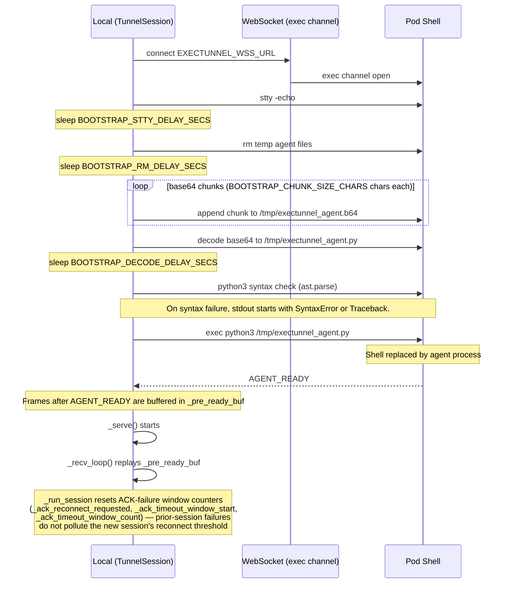

**Key invariant**: After `exec python3 /tmp/exectunnel_agent.py`, the pod shell is replaced — the WebSocket channel IS the agent's stdin/stdout. All subsequent communication is the frame protocol.

**Bootstrap failure detection in `_wait_ready()`**:
- `SYNTAX_OK` is **not validated** — `_wait_ready()` never checks for its presence. It is appended to `_bootstrap_diag` as ordinary diagnostic output.
- Syntax failure is detected by watching each incoming stdout line for the prefixes `"SyntaxError:"` or `"Traceback (most recent"`. On a match, `AgentSyntaxError` is raised immediately.
- If the WebSocket channel closes before `AGENT_READY` is seen (e.g. `exec` fails because `python3` is missing, permission denied, or the shell exits), the `async for msg in ws` iterator exhausts and `_wait_ready()` raises plain `BootstrapError` directly.
- If `AGENT_READY` never arrives but the WebSocket *stays open* for longer than `ready_timeout` (e.g. the agent process hangs silently), `asyncio.wait_for()` in `_bootstrap()` raises `TimeoutError` which is caught and re-raised as `AgentReadyTimeoutError`.
- All three — `AgentSyntaxError`, `AgentReadyTimeoutError`, and plain `BootstrapError` — are sub-classes or instances of `BootstrapError` and all map to the `Fatal` state in §10.

---

## 4. TCP CONNECT Flow

### 4.1 SOCKS5 Handshake

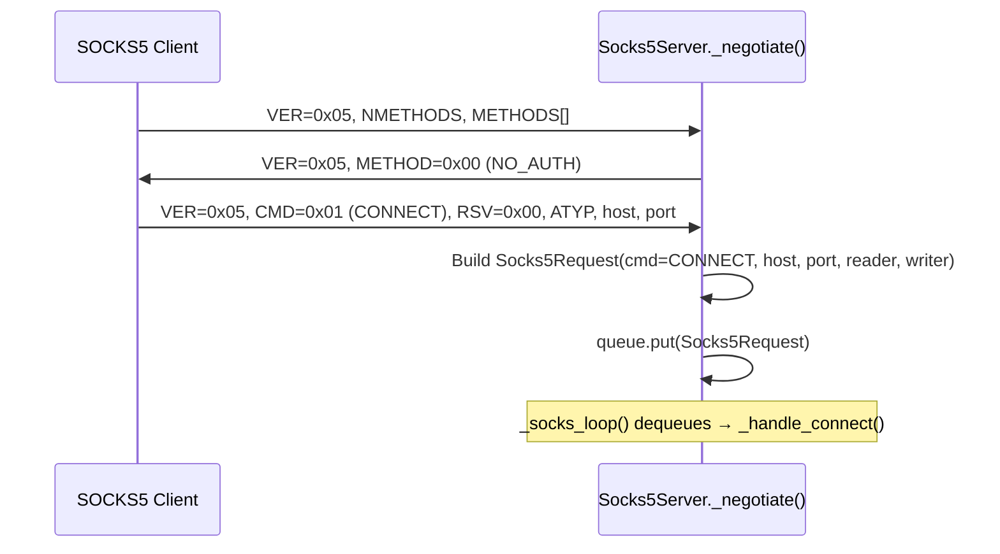

Handshake has a `HANDSHAKE_TIMEOUT_SECS` deadline. Failures (bad version, unsupported auth, incomplete read) are logged at DEBUG and the connection is closed silently.

### 4.2 Tunnel Routing Decision

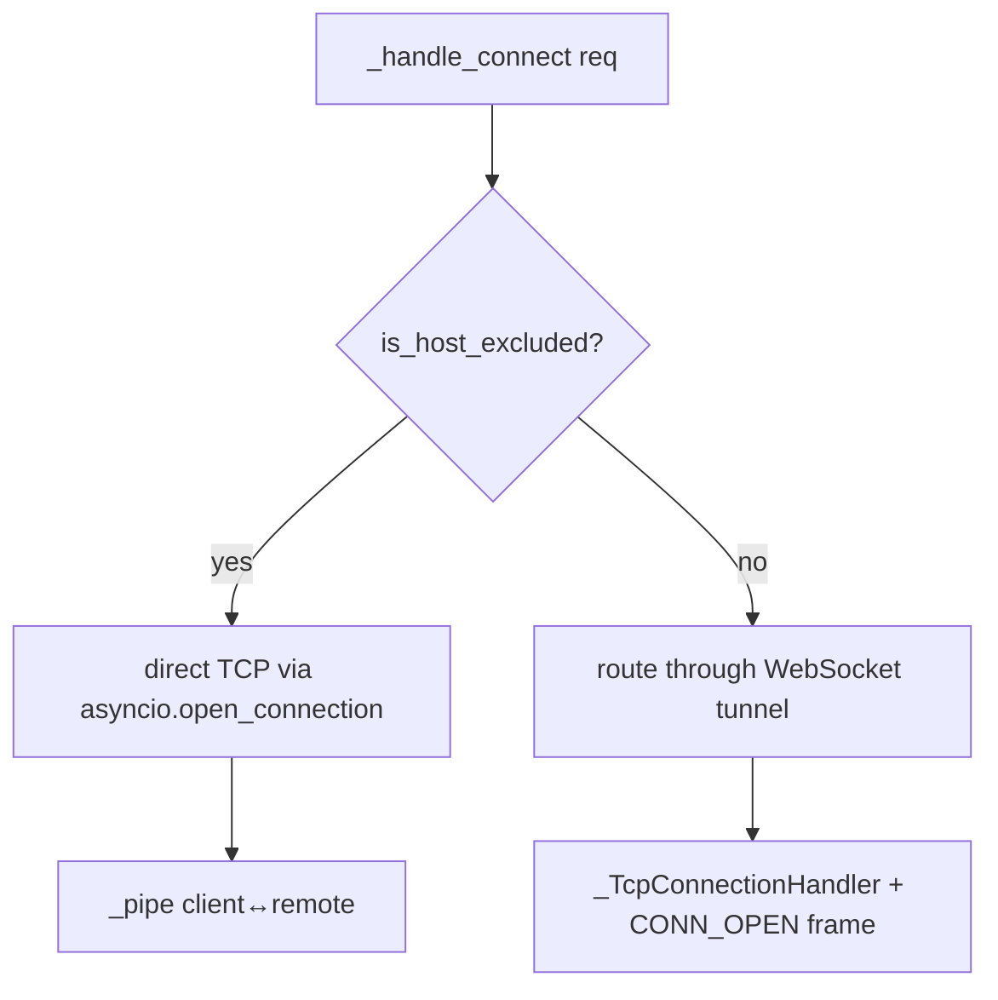

Excluded CIDRs (default: RFC1918 + loopback, configurable via `TunnelConfig.exclude`):
- `10.0.0.0/8`, `172.16.0.0/12`, `192.168.0.0/16`, `127.0.0.0/8`

### 4.3 Tunnelled TCP — Full Lifecycle

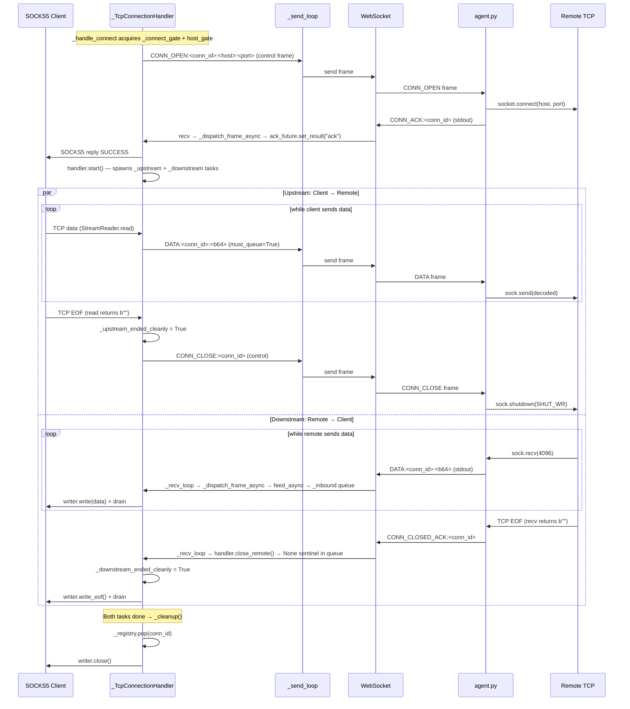

**Pre-ACK buffering**: DATA frames arriving between `CONN_OPEN` and `CONN_ACK` (before `handler.start()`) are stored in `_pre_ack_buffer` (capped at `pre_ack_buffer_cap_bytes`). On `start()`, they are flushed into `_inbound` queue.

### 4.4 Direct TCP (Excluded Hosts)

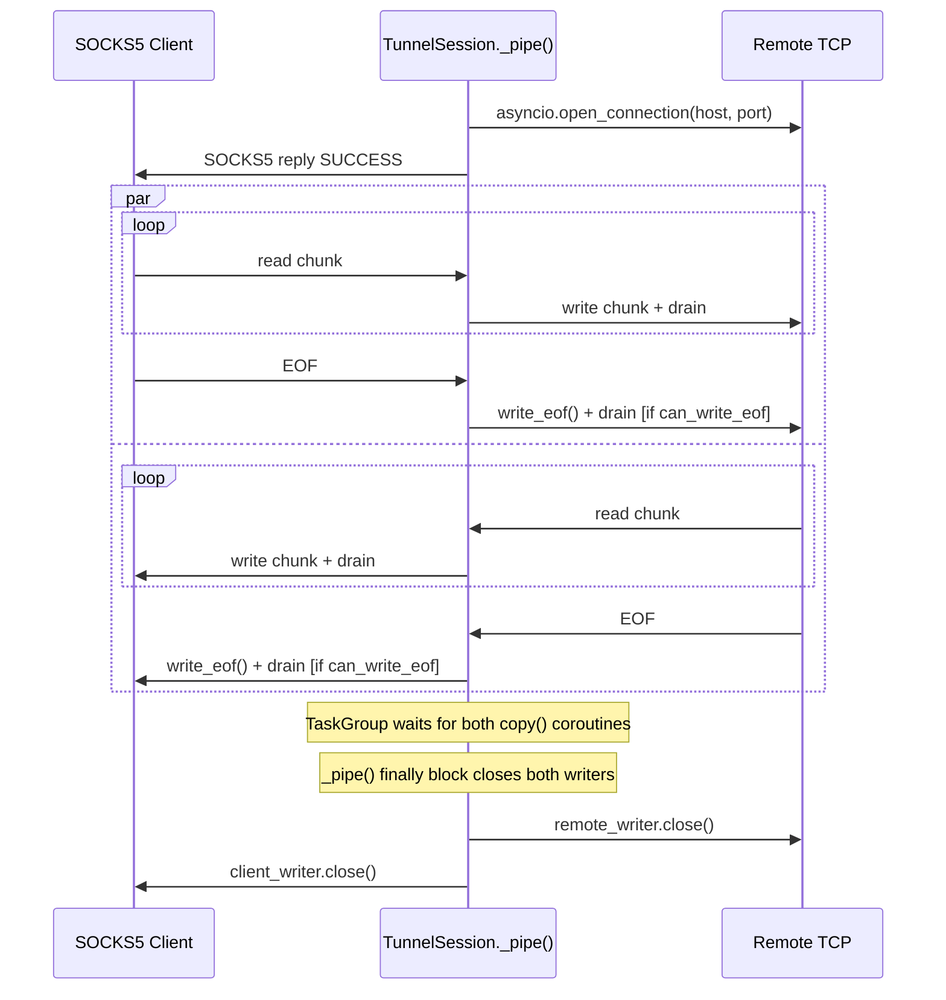

### 4.5 Half-Close & Clean Teardown

The system implements proper TCP half-close in **three layers**:

#### Layer 1 — `_TcpConnectionHandler` (`transport/connection.py`)

```
_upstream ends cleanly (EOF from client):
  → _upstream_ended_cleanly = True
  → _on_task_done: should_cancel_peer = False
  → _downstream task keeps running until agent closes

_downstream ends cleanly (None sentinel from agent):
  → writer.write_eof() + drain
  → _downstream_ended_cleanly = True
  → _on_task_done: should_cancel_peer = False
  → _upstream task keeps running until client closes
```

If either task ends with an **error or cancellation**, `should_cancel_peer = True` → peer task is cancelled immediately → `_cleanup()` closes the writer.

#### Layer 2 — `agent.py` `_io_loop` (pod side)

```
Remote sends FIN (recv returns b""):
  → remote_closed = True
  → drain remaining _inbound queue (if not local_shut)
  → break → sock.close() [no RST because send buffer empty]

Local side done (_closed set, inbound drained):
  → local_shut = True
  → sock.shutdown(SHUT_WR)  [sends FIN to remote]
  → local_shut_deadline = now + 30s
  → keep select loop reading until remote FIN or deadline
  → deadline hit → break [prevents thread leak]

After SHUT_WR:
  → pending = []  [skip inbound drain to avoid EPIPE]
```

#### Layer 3 — `_pipe()` (`transport/session.py`, direct connections)

```
src EOF → dst.write_eof() + drain [if can_write_eof]
        → return (NOT dst.close() — the peer copy() task is still running;
                  closing dst here would abort the peer's src.read() and
                  silently drop any data the remote had already sent)

After TaskGroup (both copy tasks done):
  → finally: remote_writer.close(), client_writer.close()
```

Both writers are closed **only after the `TaskGroup` exits**, ensuring neither side's in-flight read is disrupted by a premature transport close.

---

## 5. UDP ASSOCIATE Flow

### 5.1 SOCKS5 UDP Handshake

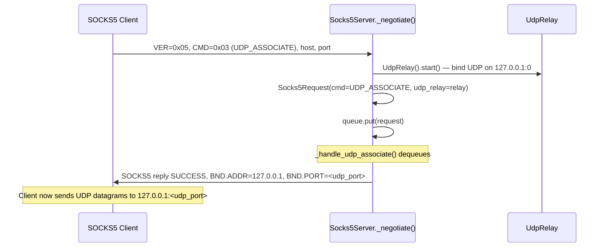

### 5.2 Tunnelled UDP Datagram Path

```mermaid
sequenceDiagram
    participant C as SOCKS5 Client (UDP)
    participant R as UdpRelay
    participant P as pump() coroutine
    participant F as _UdpFlowHandler
    participant SL as _send_loop
    participant WS as WebSocket
    participant A as agent.py
    participant D as Remote UDP

    Note over C,R: Client sends SOCKS5-wrapped UDP datagram
    C->>R: UDP datagram [RSV(2)+FRAG(1)+ATYP+host+port+payload]
    R->>R: _on_datagram(): strip header → (payload, dst_host, dst_port)
    R->>R: queue.put_nowait((payload, dst_host, dst_port))

    P->>R: relay.recv() → (payload, dst_host, dst_port)
    P->>P: is_host_excluded? → No
    P->>P: key=(dst_host,dst_port)&#59; handler=active_flows.get(key)
    alt New flow
        P->>F: _UdpFlowHandler(flow_id, dst_host, dst_port, ...)
        P->>SL: UDP_OPEN:<flow_id>:<host>:<port> (control)
        SL->>WS: send frame
        WS->>A: UDP_OPEN frame
        A->>A: UdpFlowWorker._run() thread started for flow_id
        P->>P: drain_flow task started
    end
    P->>F: handler.send_datagram(payload)
    F->>SL: UDP_DATA:<flow_id>:<b64> (data frame)
    SL->>WS: send frame
    WS->>A: UDP_DATA frame
    A->>D: sock.sendto(decoded, (host, port))

    D->>A: sock.recvfrom(65535)
    A->>WS: UDP_DATA:<flow_id>:<b64> (stdout)
    WS->>P: _recv_loop → _dispatch_frame_async → flow.feed(data)
    F->>F: _inbound.put_nowait(data)
    P->>F: drain_flow: handler.recv_datagram()
    F->>R: relay.send_to_client(data, dst_host, dst_port)
    R->>C: UDP datagram [RSV+FRAG+ATYP+src_host+src_port+payload]
```

**Flow reuse**: Flows are keyed by `(dst_host, dst_port)`. The same `_UdpFlowHandler` is reused for all datagrams to the same destination within one UDP ASSOCIATE session — enabling multi-packet exchanges (e.g. DNS retries, QUIC).

**RFC 1928 §7 note — source address in UDP reply header**: `relay.send_to_client(data, dst_host, dst_port)` uses the *destination* address as the `BND.ADDR`/`BND.PORT` in the reply UDP header. RFC 1928 §7 specifies that these fields should contain the **actual source address** of the received datagram. The deviation arises because the agent uses a connected `SOCK_DGRAM` socket (`sock.connect(host, port)` + `sock.recv()`) which discards per-packet source metadata. For the typical use-case (DNS, HTTP, proxied TCP-over-UDP) the destination == source address, so this is transparent. Clients that validate the `BND.ADDR` field against the sending server's address may malfunction if the remote source differs from the nominal destination (e.g. anycast DNS responses from a different IP).

**`drain_flow` parameter naming**: the inner coroutine `drain_flow(handler, dst_host, dst_port)` uses `dst_host`/`dst_port` throughout — matching the `active_flows` dict key `(dst_host, dst_port)` and the `pump()` call site. This reflects the semantic reality: because the agent's connected socket discards per-packet source metadata, the address placed in the SOCKS5 UDP reply header is the nominal *destination*, not a verified remote source.

**Teardown**: When `pump()` detects `req.reader.at_eof()` (SOCKS5 control TCP closed), it:
1. Calls `handler.close_remote()` + `handler.close()` for all active flows
2. Sends `UDP_CLOSE:<flow_id>` control frame to agent
3. Cancels all `drain_flow` tasks
4. Calls `relay.close()`

### 5.3 Direct UDP (Excluded Hosts)

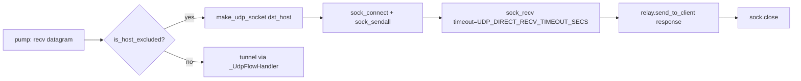

Each excluded-host UDP datagram uses a **fresh ephemeral socket** (correct address family via `make_udp_socket`). No flow reuse — fire-and-forget with a single response read.

**Design limitation**: only **one response datagram** is ever read per outbound datagram. Protocols that produce multiple response datagrams from a single send (e.g. MDNS, SNMP `GetBulk`, some QUIC handshakes) will not work correctly for excluded hosts — only the first response will be returned to the client.

### 5.4 DNS Forwarder

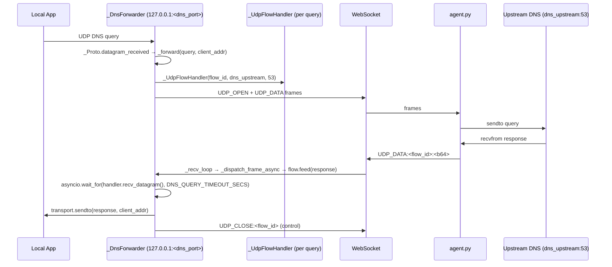

**Concurrency limit**: `max_inflight` (= `send_queue_cap`) concurrent DNS queries. Excess queries are dropped with a warning.

**Send-queue drop under load**: `send_datagram()` routes the `UDP_DATA` frame through `_send_data_queue` (bounded, `send_queue_cap` entries) without `must_queue=True`. If the data queue is full (e.g. sustained TCP traffic has saturated it), the DNS query frame is silently dropped. `recv_datagram()` then times out after `DNS_QUERY_TIMEOUT_SECS`, and the query fails. Operators who see elevated `dns.query.timeout` counter under heavy TCP load should increase `WSS_SEND_QUEUE_CAP` (default 512).

**UDP open-failure path**: if the agent fails to open the UDP socket for a `UDP_OPEN` frame (e.g. `getaddrinfo` fails), the agent emits `UDP_CLOSED:<flow_id>` immediately — **not** `ERROR`. On the local side, `_dispatch_frame_async` calls `flow.close_remote()`, which delivers a `None` sentinel. `recv_datagram()` returns `None`, `agent_closed` is set, and the query is silently dropped. This is identical in observable effect to a timeout.

**Reconnect robustness**: if a reconnect fires while `_forward` awaits `handler.recv_datagram()`, `_recv_loop`'s finally block calls `close_remote()` on all registered flows — this delivers a `None` sentinel to the handler's queue. `recv_datagram()` then returns `None`, `agent_closed` is set to `True`, and the `if response is not None` guard prevents any `transport.sendto()` call. The query is silently dropped with no crash or TypeError.

---

## 6. Frame Protocol

All frames are **newline-terminated UTF-8 strings** sent over the WebSocket channel.

### Frame Format

```
<<<EXECTUNNEL:<TYPE>[:<id>[:<payload>]]>>>\n
```

- `<<<EXECTUNNEL:` = `FRAME_PREFIX` (defined in `protocol/frames.py` and `agent.py`)
- `>>>` = `FRAME_SUFFIX`
- `<TYPE>` = frame type string (e.g. `DATA`, `CONN_OPEN`)
- `<id>` = connection ID (TCP) or flow ID (UDP); omitted for frames like `AGENT_READY`
- `<payload>` = base64-encoded data, or `host:port` for open frames; absent for control-only frames
- The trailing `\n` is the line delimiter used by both sides to split frames from the stream.

Payload and ID fields are **omitted entirely** (no trailing colon) when they are not applicable — e.g. `AGENT_READY` (no ID, no payload) or `CONN_ACK` (has ID, no payload).

Frame parsing is a **two-layer** process:

**Layer 1 — `parse_frame()` (`protocol/frames.py`)**: splits the inner frame string on the first two colons only (`split(":", 2)`):
```
msg_type = parts[0]   # e.g. "CONN_OPEN"
conn_id  = parts[1]   # e.g. "c1a2b3"
payload  = parts[2]   # entire remainder, verbatim — e.g. "2001:db8::1:443"
```
This preserves colons inside the payload (IPv6 addresses, base64 padding, etc.) intact.

**Layer 2 — payload parsing**: for `CONN_OPEN` and `UDP_OPEN` frames, the `host:port` payload is split using `rpartition(":")` — splitting at the **last** colon. This correctly handles IPv6 host addresses that themselves contain colons:
```
"2001:db8::1:443".rpartition(":")  →  host="2001:db8::1", port="443"
"example.com:443".rpartition(":")  →  host="example.com",  port="443"
```
Both the local side (`protocol/frames.py encode_conn_open_frame`) and the agent side (`_dispatch_loop` in `agent.py`) use `rpartition(":")` for this step. Any compatible re-implementation **must** use `rpartition` (or equivalent last-colon split) — a left-to-right `split(":", 1)` would silently mis-parse IPv6 hosts.

**Examples:**
```
<<<EXECTUNNEL:CONN_OPEN:c1a2b3:example.com:443>>>
<<<EXECTUNNEL:CONN_OPEN:c1a2b3:2001:db8::1:443>>>   ← IPv6: payload="2001:db8::1:443"
<<<EXECTUNNEL:DATA:c1a2b3:aGVsbG8=>>>
<<<EXECTUNNEL:CONN_CLOSE:c1a2b3>>>
<<<EXECTUNNEL:CONN_ACK:c1a2b3>>>
<<<EXECTUNNEL:AGENT_READY>>>
```

### Frame Types

| Direction | Frame | Payload | Meaning |
|---|---|---|---|
| Local → Agent | `CONN_OPEN` | `host:port` | Open TCP connection to host:port |
| Agent → Local | `CONN_ACK` | — | Connection established |
| Local → Agent | `DATA` | base64 bytes | TCP data chunk (upstream) |
| Agent → Local | `DATA` | base64 bytes | TCP data chunk (downstream) |
| Local → Agent | `CONN_CLOSE` | — | Local side done sending (EOF) |
| Agent → Local | `CONN_CLOSED_ACK` | — | Agent closed its side |
| Agent → Local | `ERROR` | base64 reason | Agent-side connection error |
| Local → Agent | `UDP_OPEN` | `host:port` | Open UDP flow to host:port |
| Local → Agent | `UDP_DATA` | base64 bytes | UDP datagram (outbound) |
| Agent → Local | `UDP_DATA` | base64 bytes | UDP datagram (inbound) |
| Local → Agent | `UDP_CLOSE` | — | Close UDP flow |
| Agent → Local | `UDP_CLOSED` | — | Agent closed UDP flow |
| Agent → Local | `AGENT_READY` | — | Bootstrap complete (no ID or payload) |

### Send Queue Architecture

There are **two queues** only:

```
_ws_send(frame, control=True)              → _send_ctrl_queue (asyncio.Queue, unbounded)
_ws_send(frame, control=False)             → _send_data_queue (asyncio.Queue, bounded cap=send_queue_cap)
_ws_send(frame, control=False, must_queue=True) → same _send_data_queue, but via
                                               awaited queue.put() instead of
                                               put_nowait() — blocks until space available
```

`must_queue=True` is **not** a separate queue. It is a calling mode on `_send_data_queue` that **`await`s `queue.put()`** — asynchronously suspending the calling coroutine until space is available — instead of dropping the frame. This is cooperative, async suspension (not thread-blocking): the event loop remains free to run other tasks while the coroutine waits. There is no third queue.

Control frames (`CONN_OPEN`, `CONN_CLOSE`, `UDP_OPEN`, `UDP_CLOSE`, keepalive) are **never dropped**.  
Data frames (`DATA`, `UDP_DATA`) sent via `must_queue=True` (upstream TCP path) **`await` `queue.put()`** until space is available — this is the TCP backpressure mechanism. Data frames sent without `must_queue` (UDP drain path) use `put_nowait()` and are dropped when the data queue is full (logged with drop count).

---

## 7. Send Loop & Backpressure

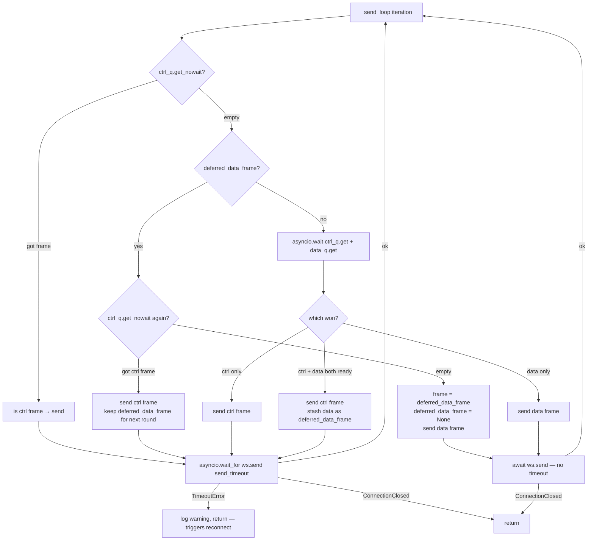

**Priority**: Control frames always take priority over data frames. When both are ready simultaneously, the data frame is stashed as `deferred_data_frame` and sent on the next iteration.

**Deferred-frame ctrl-recheck**: Before sending a stashed `deferred_data_frame`, the loop performs an **extra `ctrl_q.get_nowait()`** check. If a new control frame has arrived in the meantime, that control frame is sent first and the data frame remains deferred for one more iteration. This ensures a sustained stream of data frames cannot starve control frames for more than a single send-cycle latency.

**Deferred-frame loss on shutdown**: When `_serve`'s finally block sends `None` (the poison pill) to `_send_ctrl_queue`, the loop picks it up via `ctrl_q.get_nowait()` and returns immediately. If a `deferred_data_frame` is pending at that moment, it is silently discarded. This is intentional and correct: once the WebSocket is closing, delivering the final in-flight data frame is neither safe nor necessary. The loss of one data frame during teardown is an acceptable trade-off for a clean shutdown path.

**Send timeouts**:
- Data frames (`DATA`, `UDP_DATA`): **no timeout** — `await ws.send()` runs unbounded. Backpressure is handled upstream by `_ws_send(must_queue=True)` asynchronously suspending the reader, which lets TCP flow-control slow the sender naturally. If the WebSocket closes during a data-frame send, `ConnectionClosed` is caught by the same `except ConnectionClosed` block that handles control frames — the loop exits and `_ws_closed` is set, triggering reconnect. Data frames do **not** swallow `ConnectionClosed`.
- Control frames (including `KEEPALIVE`): `bridge.send_timeout` — on `TimeoutError` the loop **exits**, triggering a WebSocket reconnect. `ConnectionClosed` also exits the loop identically.

**Built-in WebSocket ping disabled**: `ping_interval=None` is passed to `websockets.connect()` to eliminate write-lock contention between the ping background task and `ws.send()` under sustained load.

**Backpressure (tunnel → agent)**: `_upstream` calls `_ws_send(must_queue=True)` which **`await`s `queue.put()`**, asynchronously suspending the coroutine until the send queue has space. When the send queue is full (WS is slow), `_upstream` stalls, the asyncio reader stops consuming from the TCP socket, the kernel receive buffer fills, and TCP window shrinks to zero — slowing the remote sender naturally without tearing down the connection.

**Backpressure (agent → tunnel)**: `_recv_loop` calls `_dispatch_frame_async()` which uses `await handler.feed_async(data)` for post-ACK DATA frames — blocking the WS reader when the inbound queue is full. This stalls the WS reader, fills the kernel TCP receive buffer on the WS connection, and propagates backpressure all the way to the agent's `_write_data_frame()` call, which blocks the worker thread, which stalls its `select` loop, which fills the remote TCP receive buffer.

**Backpressure (agent stdout)**: `_FrameWriter.emit_data()` blocks the calling worker thread when the bounded `_data` queue (`_STDOUT_DATA_QUEUE_CAP=2048`) is full. This stalls the worker's `select` loop, fills the kernel TCP receive buffer, and lets TCP flow-control slow the remote sender naturally — no frames dropped.

---

## 8. Agent Side (pod)

The agent runs as a single Python process with:
- **Main thread**: `_dispatch_loop()` — reads stdin line-by-line, dispatches frames
- **`stdout-writer` daemon thread**: `_FrameWriter._run()` — serialises all stdout writes with control-frame priority
- **One thread per TCP connection**: `TcpConnectionWorker._io_loop()`
- **One thread per UDP flow**: `UdpFlowWorker._io_loop()` (started by `UdpFlowWorker._run()`, the thread target)

**`_FrameWriter` flush timing**: the writer loop does `ctrl.get(timeout=0.005)` (5 ms poll). When a control frame arrives in `_ctrl`, it is written **plus all other pending control frames** (via a `get_nowait()` drain loop) before any data frames are touched. Then up to 64 data frames are written per cycle. Consequence: a `CONN_ACK` (or any other ctrl frame) is dequeued within at most ~5 ms of being enqueued — regardless of how many data frames are queued in `_data`. The 64-frame batch cap governs only the *data frame* drain rate between control-check iterations and does not delay control frames.

**Timing caveat**: the ~5 ms figure is the maximum *queue-poll wake-up latency*, not the end-to-end write latency. If the kernel pipe buffer is under pressure (e.g. the local-side WebSocket reader is not consuming stdout fast enough), each `sys.stdout.write()` call may block briefly. The actual time from `_write_ctrl_frame()` call to `sys.stdout.flush()` completion can therefore exceed 5 ms under sustained high-throughput conditions. In practice this only occurs when the entire send path is already saturated.

### 8.1 TCP Connection Worker

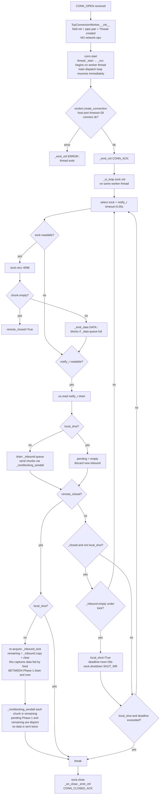

**Thread safety**: `_inbound` list is protected by `_inbound_lock`. `_notify_r`/`_notify_w` is a `os.pipe()` pair used to wake the select loop when new data is fed via `TcpConnectionWorker.feed()`.

**Two-phase inbound drain on `remote_closed`**: Every loop iteration first drains `_inbound` under `_inbound_lock` into `pending` and sends it (Phase 1). When `remote_closed` is then detected, `_inbound_lock` is re-acquired a second time to capture any chunks that `TcpConnectionWorker.feed()` (running on the main stdin-reader thread) may have appended **after** Phase 1 released the lock but **before** the break (Phase 2). `pending` and `remaining` are temporally disjoint — no chunk is ever sent twice.

**Connect timeout**: `socket.create_connection(host, port, timeout=28)` is called inside `TcpConnectionWorker._run()` — the worker thread's **first action**, not in `__init__`. `__init__` only initialises fields, creates the `os.pipe()` notification pair, and instantiates (but does not start) the thread. `conn.start()` launches the thread, and the main stdin-reader thread returns to the dispatch loop immediately. If the connection attempt exceeds 28 seconds, `OSError` is caught inside `_run()`, an `ERROR:<conn_id>:<reason>` control frame is emitted, and the worker thread exits without ever entering `_io_loop`.

**Inbound saturation path** (`TcpConnectionWorker.feed()`, called from main stdin-reader thread): if `len(_inbound) >= _MAX_TCP_INBOUND_CHUNKS` (1024 chunks), the connection is considered saturated:
1. `_saturated = True` and `_closed = True` are set atomically **inside** `_inbound_lock` to prevent any further `feed()` calls from appending data.
2. `_inbound_lock` is **released** before calling `_emit_ctrl` — the ERROR control frame is enqueued outside the lock to avoid holding `_inbound_lock` across the `queue.SimpleQueue.put()` call in `_FrameWriter`, which could unnecessarily extend the lock's critical section under GIL contention.
3. The IO loop will do `SHUT_WR` on its next iteration, then drain remaining receives and emit `CONN_CLOSED_ACK`.

**Consequence on the local side**: the local `_dispatch_frame_async` will receive **both** `ERROR` and `CONN_CLOSED_ACK` for the same `conn_id`. The `ERROR` handler calls `handler.cancel_upstream()` and `handler.close_remote()` (delivers `None` sentinel). When `CONN_CLOSED_ACK` arrives later, `close_remote()` is called again — this is a no-op because `_TcpConnectionHandler._closed` is already set, so no duplicate sentinel is delivered.

### 8.2 UDP Flow Worker

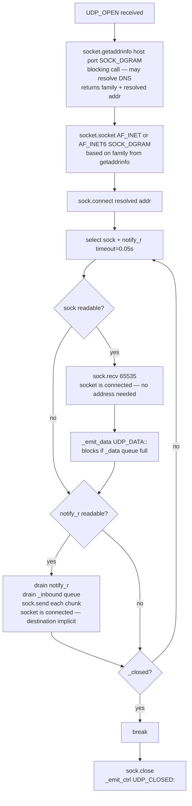

**Connected socket semantics**: After `sock.connect(addr)`, the UDP socket is bound to a specific remote address at the kernel level. `recv()` (not `recvfrom`) is correct because the source address is fixed by `connect()`; `recvfrom()` would return a redundant `(data, address)` pair. `send()` (not `sendto()`) is correct because the destination is implicit — calling `sendto()` on a connected socket raises `OSError: [Errno 106] Transport endpoint is already connected` on Linux.

**DNS resolution in thread**: `UdpFlowWorker._run()` calls `socket.getaddrinfo(host, port, type=SOCK_DGRAM)` synchronously before creating the socket. This call determines the correct address family (AF_INET vs AF_INET6) and resolves domain names. For numeric IP addresses it returns instantly from the OS name-service cache. For domain-name hosts it performs a blocking DNS lookup — potentially several seconds depending on the resolver. Under high concurrency with domain-name UDP targets, threads can accumulate blocked in `getaddrinfo`, leading to thread-pool exhaustion. In practice, the `_DnsForwarder` always targets a numeric IP (`dns_upstream` config value), so this slow path is rarely exercised in normal operation.

---

## 9. Connection Hardening & Rate Limiting

### Concurrency Gates

```
_connect_gate = asyncio.Semaphore(connect_max_pending)          # global
_host_connect_gates[host] = asyncio.Semaphore(per_host_limit)   # per host
```

Both gates are acquired before sending `CONN_OPEN` and released after ACK wait completes (success or failure).

**Pre-semaphore registration window**: `_conn_handlers[conn_id]` and `_pending_connects[conn_id]` are populated **before** the semaphore is acquired, not after. This means there is a brief window where a handler is registered in the registry but `CONN_OPEN` has not yet been sent to the agent. In practice no `DATA` or `CONN_ACK` frames can arrive for a connection the agent has not yet received `CONN_OPEN` for — so the window is harmless. The observable risk is: if a reconnect fires in this window, `_recv_loop`'s finally block will call `close_remote()` on the unstarted handler. `close_remote()` delivers a `None` sentinel into `_inbound`, which is safe — `_upstream`/`_downstream` tasks have not started, the sentinel sits unconsumed, and the handler cleans up when the semaphore is eventually acquired and the `"ws_closed"` abort path is taken.

Special case — `challenges.cloudflare.com`:
- Per-host limit capped at `connect_max_pending_cf`
- Paced: minimum `CONNECT_PACE_CF_INTERVAL_SECS` seconds between `CONN_OPEN` frames (with jitter up to `CONNECT_PACE_JITTER_CAP_SECS`)

### ACK Timeout & Reconnect Trigger

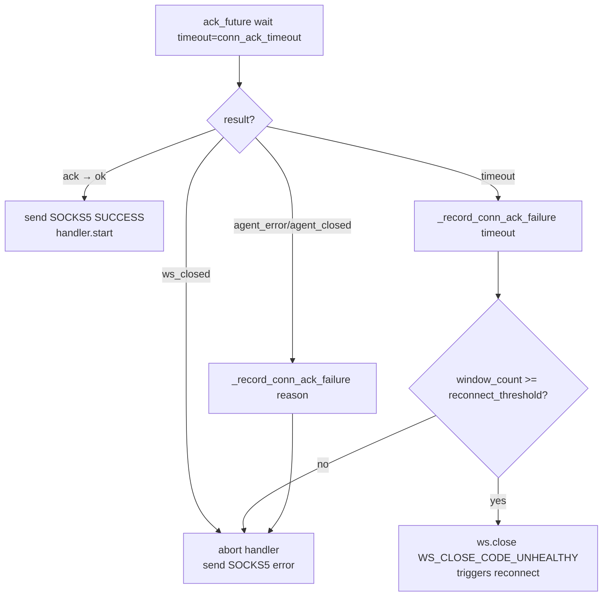

### Pre-ACK Buffer

Between `CONN_OPEN` and `CONN_ACK`, DATA frames from the agent are stored in `_pre_ack_buffer` (a `list[bytes]` capped at `pre_ack_buffer_cap_bytes` total bytes). On `handler.start()`, they are flushed into `_inbound` queue.

**Overflow handling** — `_dispatch_frame_async` uses the following logic before calling `handler.feed()`:

1. If `handler._closed` is already set (e.g. a prior `ERROR` frame already triggered teardown), the DATA frame is **silently dropped** — the connection is already aborting and no ack-future result is set. This prevents spurious `"pre_ack_overflow"` failures and associated reconnect-threshold increments.
2. Otherwise, `handler.feed(data)` is called. A `False` return here unambiguously means the buffer cap was exceeded → `ack_future.set_result("pre_ack_overflow")` → connection aborted.

---

## 10. Reconnect & Session Lifecycle

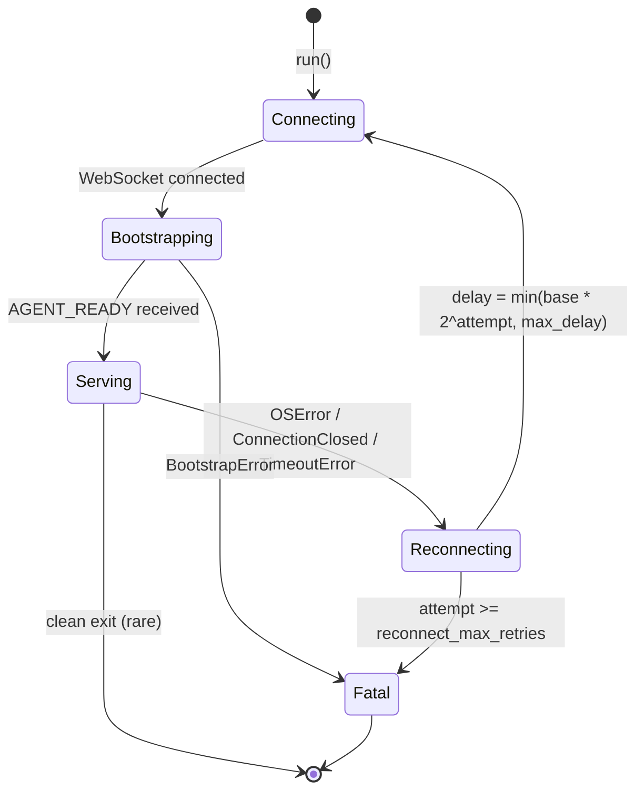

On reconnect:
- All open `_TcpConnectionHandler` instances receive `close_remote()` (None sentinel) via `_recv_loop` finally block
- All `_UdpFlowHandler` instances receive `close_remote()`
- `_ws_closed` event is set — unblocks any pending ACK waits **that have already entered `asyncio.wait`**
- The reconnect `attempt` counter in `run()` resets to `0` after each successful bootstrap (once `_serve()` starts). The retry budget is per-consecutive-failure-run, not lifetime — a long-running process with 5 widely-spaced reconnects never exhausts retries.
- `_run_session()` resets the per-session ACK-failure window counters (`_ack_reconnect_requested = False`, `_ack_timeout_window_count = 0`) immediately after `_bootstrap()` completes, preventing stale counts from a prior session triggering a premature reconnect in the new one.

`Bootstrapping → Fatal` is triggered by any `BootstrapError`. Three concrete causes:
1. `AgentSyntaxError` — agent script syntax error (stdout prefix `SyntaxError:` / `Traceback (most recent`)
2. `AgentReadyTimeoutError` — WebSocket stayed open but `AGENT_READY` not received within `ready_timeout`
3. plain `BootstrapError` — WebSocket closed before `AGENT_READY` (`exec` failed, `python3` missing, permission denied, etc.)

All three are caught by `except BootstrapError: raise` in `run()` and are **not** retried.

**Semaphore-blocked connects**: `_handle_connect` coroutines that are still waiting to acquire `_connect_gate` or a per-host gate have not yet started the ACK wait and are not directly unblocked by `_ws_closed`. They remain queued on the semaphore until a prior holder releases it, at which point they acquire it and attempt to send `CONN_OPEN`. However, `_ws_send(frame, control=True)` first checks `_ws_closed.is_set()` before enqueuing the frame — if `_ws_closed` is already set, the `CONN_OPEN` frame is **silently suppressed** (never sent to the agent). The coroutine then enters `asyncio.wait({ack_task, ws_future}, ...)`. Because `_ws_closed` is already set, `ws_future` resolves in the same event loop iteration — the coroutine aborts with `"ws_closed"` without waiting for `conn_ack_timeout`. The observable delay between the reconnect event and the SOCKS5 error response for these connections is bounded only by the **semaphore wait time** (i.e. how long until a prior holder exits), not by `conn_ack_timeout`. They do exit correctly and clean up `_pending_connects`.

---

## 11. Key Data Structures

### `TunnelSession` registries

| Field | Type | Purpose |
|---|---|---|
| `_conn_handlers` | `dict[str, _TcpConnectionHandler]` | Active TCP connections keyed by conn_id |
| `_pending_connects` | `dict[str, PendingConnectState]` | Connections awaiting CONN_ACK |
| `_udp_registry` | `dict[str, _UdpFlowHandler]` | Active UDP flows keyed by flow_id |

### `_TcpConnectionHandler` queues and state

| Field | Type | Cap | Purpose |
|---|---|---|---|
| `_inbound` | `asyncio.Queue[bytes\|None]` | `TCP_INBOUND_QUEUE_CAP` | Agent→client data + None sentinel |
| `_pre_ack_buffer` | `list[bytes]` | `pre_ack_buffer_cap_bytes` | Data before CONN_ACK |
| `_closed` | `asyncio.Event` | — | Set when handler is fully torn down; gates `feed()`, `feed_async()`, `close_remote()`, and `_cleanup()`. Primary liveness check in `_dispatch_frame_async`. |
| `_upstream_ended_cleanly` | `bool` | — | `True` when `_upstream` read EOF without error; prevents `_on_task_done` from cancelling the peer `_downstream` task (half-close invariant) |
| `_downstream_ended_cleanly` | `bool` | — | `True` when `_downstream` received the `None` sentinel without error; prevents `_on_task_done` from cancelling the peer `_upstream` task (half-close invariant) |

### `_UdpFlowHandler` queue

| Field | Type | Cap | Purpose |
|---|---|---|---|
| `_inbound` | `asyncio.Queue[bytes\|None]` | `TCP_INBOUND_QUEUE_CAP` | Agent→client datagrams + None sentinel |

### `UdpRelay` queue

| Field | Type | Cap | Purpose |
|---|---|---|---|
| `_queue` | `asyncio.Queue[tuple[bytes,str,int]]` | `UDP_SEND_QUEUE_CAP` | Client→tunnel datagrams (payload, host, port) |

### Agent `TcpConnectionWorker` (pod side)

| Field | Type | Purpose |
|---|---|---|
| `_inbound` | `list[bytes]` | Data to send to remote TCP (protected by `_inbound_lock`) |
| `_notify_r/w` | `os.pipe()` | Wakes select loop when `feed()` adds data |
| `_closed` | `bool` | Set when `CONN_CLOSE` received from local |

### Agent `_FrameWriter`

| Field | Type | Cap | Purpose |
|---|---|---|---|
| `_ctrl` | `queue.SimpleQueue` | unbounded | Control frames — always flushed before data |
| `_data` | `queue.Queue` | `_STDOUT_DATA_QUEUE_CAP` (2048) | Data frames — `emit_data()` blocks when full |

---

## Appendix: Critical Invariants

1. **No RST on clean close**: Both sides use `write_eof()` / `sock.shutdown(SHUT_WR)` before closing, ensuring FIN not RST.
2. **Control frames never dropped**: `_send_ctrl_queue` is unbounded; only data queue is bounded.
3. **Pre-ACK data preserved**: DATA frames before CONN_ACK are buffered, not dropped.
4. **Thread leak prevention**: `local_shut_deadline` (30s) in `_io_loop` ensures threads exit even if remote never sends FIN.
5. **EPIPE prevention**: After `SHUT_WR`, `_io_loop` discards new inbound data instead of calling `sendall`.
6. **Queue full → guaranteed sentinel delivery**: `close_remote()` evicts one item if queue is full before inserting `None`.
7. **Single WebSocket writer**: All frames go through `_send_loop` — no concurrent `ws.send()` calls.
8. **No ping lock contention**: Built-in websockets ping is disabled (`ping_interval=None`); keepalive is sent as a `KEEPALIVE` control frame through `_send_ctrl_queue` by `_keepalive_loop`, serialised safely through `_send_loop`.
9. **End-to-end backpressure (downstream)**: `_recv_loop` → `feed_async` → `_inbound.put()` → WS reader stalls → agent `emit_data()` blocks → worker `select` stalls → remote TCP window shrinks.
10. **Agent stdout serialised**: All agent stdout writes go through `_FrameWriter` daemon thread — no concurrent `sys.stdout.write()` calls from worker threads.
